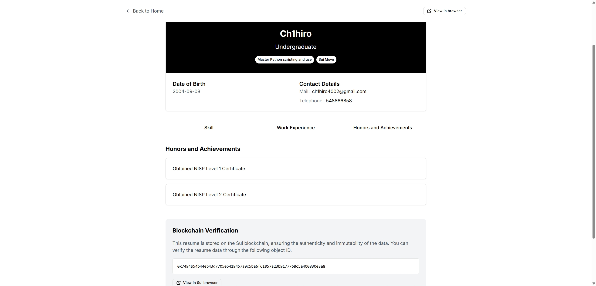

- # ProofMe - Sui Resume System

  

    
  

  
  
  
  

    A decentralized resume platform based on Sui blockchain
  

  
  

    <a href="README_CN.md">中文</a> | <strong>English</strong>
  

  
  ## 📖 Project Introduction
  
  ProofMe is a decentralized resume platform based on Sui blockchain that allows users to create, manage, and share their professional resumes while leveraging blockchain technology to ensure data authenticity and immutability. Users can add skills, work experiences, and achievements, and enhance their identity credibility through social account binding.
  
  ### Core Features
  
  - **Blockchain Storage**: Resume data is stored on the Sui blockchain, ensuring data immutability
  - **Decentralized Identity**: Users control their own data through wallets, no centralized accounts needed
  - **Social Verification**: Support for binding Twitter and other social accounts to enhance resume credibility
  - **Hybrid Storage Strategy**: Text data stored on-chain, large files like images stored on Walrus decentralized storage
  - **Responsive Design**: Adapts to various device sizes, providing a good mobile experience
  
  ## 🚀 Quick Start
  
  ### Prerequisites
  
  - Node.js 16+
  - npm or yarn
  - Sui wallet (such as Sui Wallet browser extension)
  
  ### Installation
  
  1. Clone the repository
  
  \`\`\`bash
  git clone https://github.com/Ch1hiro4002/ProofMe.git
  cd ProofMe
  \`\`\`
  
  2. Install dependencies
  
  \`\`\`bash
  npm install
  \`\`\`
  
  ## 📚 Features
  
  ### 1. Resume Creation and Management
  
  - **Create Resume**: Fill in basic information, upload avatar
  - **Add Skills**: Add personal skills and expertise
  - **Add Work Experience**: Record work history
  - **Add Achievements**: Record personal achievements and certificates
  
  ### 2. Social Account Binding

  - **Twitter Binding**: Verify Twitter account ownership
  - **Identity Verification**: Enhance resume credibility
  
  ### 3. Resume Browsing and Search

  - **Browse Resumes**: View resumes on the platform
  - **Search Function**: Search resumes by skills, name, etc.
  
  ## 💻 Technology Stack
  
  - **Frontend Framework**: React + TypeScript
  - **Build Tool**: Vite
  - **Blockchain Interaction**: @mysten/dapp-kit, @mysten/sui
  - **Routing**: React Router
  - **Styling**: Tailwind CSS
  - **Storage**: Walrus decentralized storage
  
  ## 🔗 Smart Contract
  
  The project uses Sui Move smart contracts to store and manage resume data. The main functions of the contract include:
  
  - Creating resumes
  - Adding skills
  - Adding work experiences
  - Adding achievements
  - Verifying resume data
  
  The contract code is located in the `move/` directory
  
  ## 📚 Page Display
  
  
  
  
  
  
  
  
  
  Project URL: https://codeboy.wal.app/
  
  Demo Video: https://www.youtube.com/watch?v=P_8TxZt_8-Q
  
  ## 📞 Contact Information
  
  - Project Maintainer: Ch1hiro
  - Email: ch1hiro4002@gmail.com
  - X: https://x.com/Ch1hiro4002
  - GitHub: https://github.com/Ch1hiro4002
