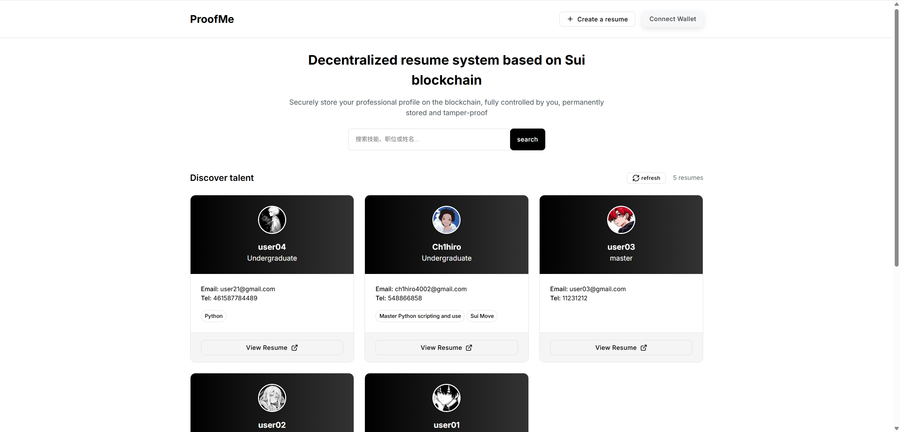
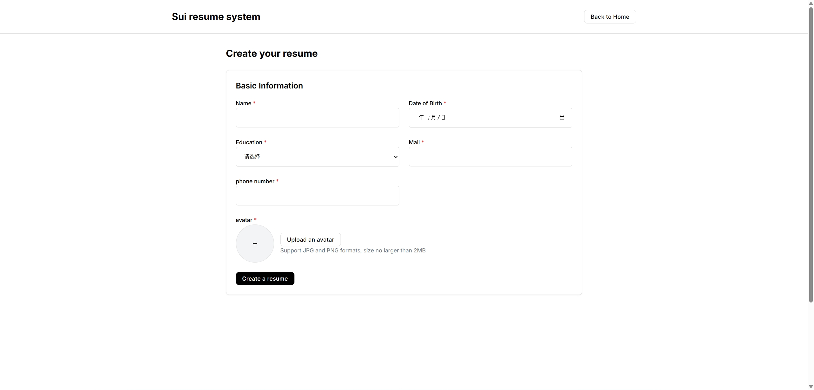

# ProofMe - Sui简历系统

  

  基于Sui区块链的去中心化简历平台

  <strong>中文</strong> | <a href="README.md">English</a>

## 📖 项目介绍

ProofMe是一个基于Sui区块链的去中心化简历平台，允许用户创建、管理和分享他们的职业简历，同时利用区块链技术确保数据的真实性和不可篡改性。用户可以添加技能、工作经验和成就，并通过社交账户绑定增强身份可信度。

### 核心特点

- **区块链存储**：简历数据存储在Sui区块链上，确保数据不可篡改
- **去中心化身份**：用户通过钱包控制自己的数据，无需中心化账户
- **社交验证**：支持绑定Twitter等社交账户，增强简历可信度
- **混合存储策略**：文本数据存储在链上，图片等大文件存储在Walrus去中心化存储
- **响应式设计**：适配各种设备尺寸，提供良好的移动端体验

## 🚀 快速开始

### 前提条件

- Node.js 16+
- npm 或 yarn
- Sui钱包（如Sui Wallet浏览器扩展）

### 安装

1. 克隆仓库

\`\`\`bash
git clone https://github.com/Ch1hiro4002/ProofMe.git
cd ProofMe
\`\`\`

2. 安装依赖

\`\`\`bash
npm install
\`\`\`

## 📚 功能说明

### 1. 简历创建与管理

- **创建简历**：填写基本信息、上传头像
- **添加技能**：添加个人技能和专长
- **添加工作经验**：记录工作经历
- **添加成就**：记录个人成就和证书

### 2. 社交账户绑定

- **Twitter绑定**：验证Twitter账户所有权
- **身份验证**：增强简历可信度

### 3. 简历浏览与搜索

- **浏览简历**：查看平台上的简历
- **搜索功能**：按技能、姓名等搜索简历

## 💻 技术栈

- **前端框架**：React + TypeScript
- **构建工具**：Vite
- **区块链交互**：@mysten/dapp-kit, @mysten/sui
- **路由**：React Router
- **样式**：Tailwind CSS
- **存储**：Walrus去中心化存储

## 🔗 智能合约

项目使用Sui Move智能合约来存储和管理简历数据。合约主要功能包括：

- 创建简历
- 添加技能
- 添加工作经验
- 添加成就
- 验证简历数据

合约代码位于 `move/` 目录下

## 📚 页面展示

项目地址：https://ch1hiro.wal.app/

演示视频：https://www.youtube.com/watch?v=P_8TxZt_8-Q

## 📞 联系方式

- 项目维护者：Ch1hiro
- 邮箱：ch1hiro4002@gmail.com
- X：https://x.com/Ch1hiro4002
- GitHub：https://github.com/Ch1hiro4002